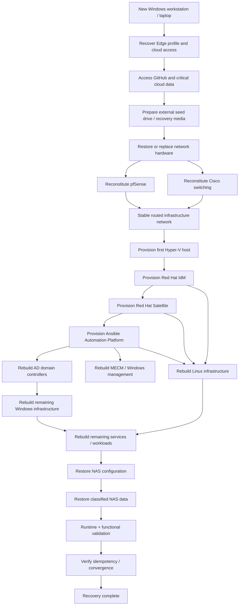
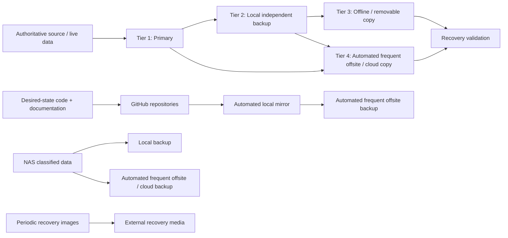

# Operation Desired State — Architecture Draft

This document captures the initial whole-lab recovery/control-plane architecture. It is intentionally high level and will be refined as repository ownership and dependencies are assessed.

## Catastrophic recovery control flow

## Backup/control-plane concept

The working backup model uses four tiers. The exact cadence and retention may vary by data classification, but Tier 4 has an explicit requirement: **offsite/cloud replication must be automated and frequent** rather than dependent on manual copy operations.

### Tier definitions

- **Tier 1 — Primary:** active authoritative copy used by the workload or user.
- **Tier 2 — Local independent backup:** separate local copy that is not merely another view of the same storage failure domain.
- **Tier 3 — Offline/removable:** disconnected or removable copy intended to survive compromise, corruption, or broader local failure.
- **Tier 4 — Offsite/cloud:** geographically/failure-domain independent copy, **automatically pushed and refreshed frequently** according to the data class.

The target is not simply to possess four copies. Each tier must address a distinct failure mode, and restoration must be tested where practical.

For Git repositories, Operation Desired State should include or reference an Ansible-driven workflow that:

1. enumerates authoritative repositories,
2. creates or refreshes independent local mirrors,
3. pushes/mirrors them to an approved offsite target,
4. verifies the backup result,
5. reports failures clearly,
6. can itself be reconstructed from Git/documentation.

The same automation-first expectation applies to approved NAS data classes that require offsite retention.

## Architectural principles

- Git and documentation are authoritative for reproducible configuration.
- Recovery images accelerate bootstrap but do not replace desired-state sources.
- Hardware replacement may be like-for-like or better; capability intent is more important than exact model identity.
- Platform databases and PKI continuity are not mandatory if services can be cleanly reconstructed.
- Personal/irreplaceable data and source repositories require N-tier backup.
- Tier 4 is an automated, frequent offsite/cloud process, not a manual archival activity.
- Backup success is not assumed from job completion alone; recovery/verification evidence is required.
- The recovery interface is a tested runbook and dependency flow, not necessarily a literal one-click process.
- Each component must be independently restorable and validated before the whole-lab flow can be considered proven.

## Required future diagrams

- physical topology
- VLAN/routing topology
- service dependency graph
- identity/DNS/time/PKI relationships
- management/control-plane dependencies
- backup/data classification and flow
- recovery runbook sequence with checkpoints
