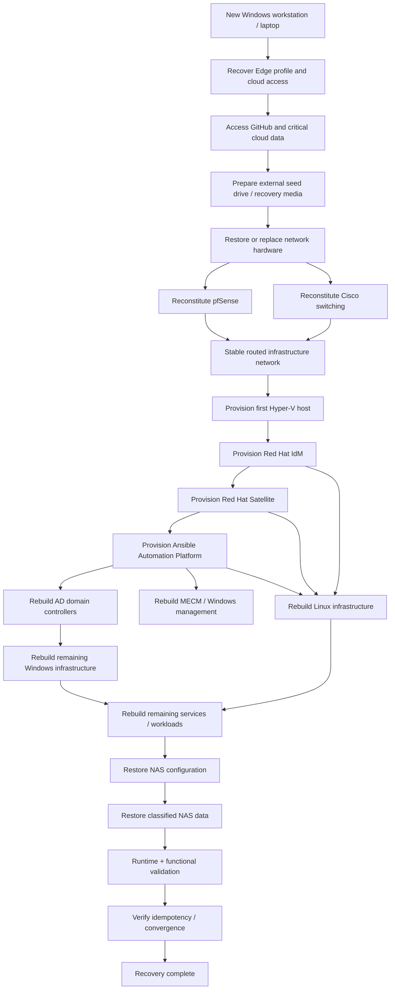
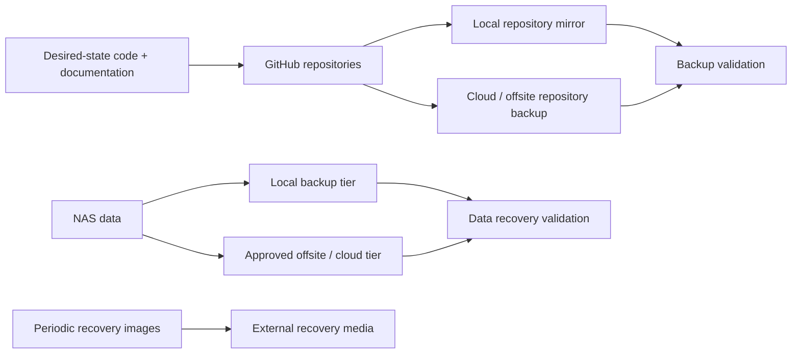

# Operation Desired State — Architecture Draft

This document captures the initial whole-lab recovery/control-plane architecture. It is intentionally high level and will be refined as repository ownership and dependencies are assessed.

## Catastrophic recovery control flow

## Backup/control-plane concept

## Architectural principles

- Git and documentation are authoritative for reproducible configuration.
- Recovery images accelerate bootstrap but do not replace desired-state sources.
- Hardware replacement may be like-for-like or better; capability intent is more important than exact model identity.
- Platform databases and PKI continuity are not mandatory if services can be cleanly reconstructed.
- Personal/irreplaceable data and source repositories require N-tier backup.
- The recovery interface is a tested runbook and dependency flow, not necessarily a literal one-click process.
- Each component must be independently restorable and validated before the whole-lab flow can be considered proven.

## Required future diagrams

- physical topology
- VLAN/routing topology
- service dependency graph
- identity/DNS/time/PKI relationships
- management/control-plane dependencies
- backup/data classification and flow
- recovery runbook sequence with checkpoints
