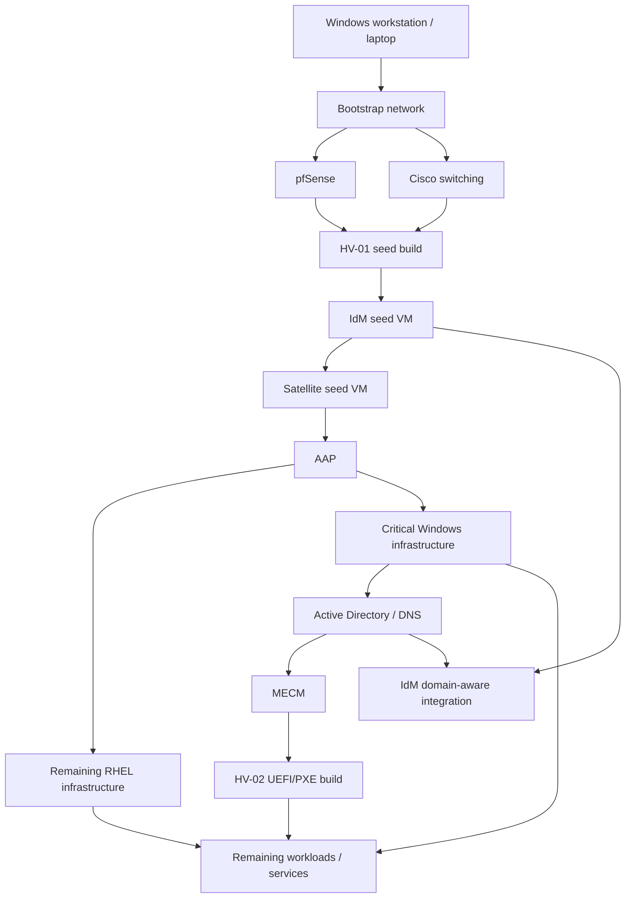

# Operation Desired State — Bootstrap Architecture Draft

This document captures the current intended greenfield bootstrap sequence for reconstructing the lab from a minimal external control plane.

The architecture is intentionally seed-driven: a small number of independently bootstrappable systems establish the platform services required to build everything else declaratively.

## Bootstrap objective

The lab should be reconstructable beginning with:

- a Windows workstation/laptop;
- Internet access;
- access to authoritative Git repositories and required cloud-hosted information;
- suitable physical replacement hardware;
- recovery/install media as needed.

The first major milestone is to establish a self-hosting management stack capable of provisioning the remaining environment.

## Seeded bootstrap sequence

### Phase 0 — External control point

1. Provision the Windows workstation/laptop.
2. Recover GitHub and other cloud access.
3. Obtain required installation media, drivers, firmware utilities, and seed automation.

This system is the only assumed external administrative control point.

### Phase 1 — Foundational network edge

4. Install or restore pfSense first where practical.
5. Restore required routing, VLAN, DNS-forwarding/resolver, DHCP, and management-network functionality.
6. Restore Cisco switching sufficiently to support the bootstrap VLAN/trunk design.

Rationale: the first Linux infrastructure nodes may require reliable Internet access, routing, DNS, and package/update reachability before higher-level identity/content-management services exist.

The exact pfSense/Cisco ordering may vary depending on replacement hardware and temporary cabling, but stable bootstrap networking is a dependency gate before moving into managed infrastructure services.

### Phase 2 — Seed Hyper-V host

7. Build **HV-01** as the first seeded Hyper-V host.

The preferred seed mechanism is a **MECM-derived standalone task sequence/media** capable of installing Windows Server and Hyper-V without requiring the production MECM infrastructure to already exist.

The HV-01 seed process should establish only what is necessary to host the first infrastructure VMs. It must not depend on AD, IdM, Satellite, AAP, or another lab-hosted management service.

HV-01 becomes the first virtualization substrate for the bootstrap control plane.

### Phase 3 — Red Hat IdM seed

8. Provision an IdM VM on HV-01 from a dedicated RHEL seed image/profile designed specifically for IdM.
9. Apply the IdM installation automation/playbook.
10. Bring IdM online in a **standalone initial state without external AD-domain awareness or cross-realm trust**.

The IdM seed must not depend on Satellite for its initial OS installation.

The IdM platform should be capable of receiving normal operating-system updates through the bootstrap network before Satellite is available, if required.

This phase establishes the initial Linux identity/DNS/Kerberos control plane.

### Phase 4 — Red Hat Satellite seed

11. Provision the Satellite VM on HV-01 from a dedicated RHEL seed image/profile architected for Satellite.
12. Apply Satellite installation automation.
13. Configure the minimum content/subscription state required to support managed RHEL provisioning.

The Satellite build must not require AAP to exist first.

Satellite then becomes the authoritative RHEL lifecycle/content platform for subsequent managed Linux builds.

### Phase 5 — Ansible Automation Platform

14. Use the now-available Red Hat management stack to provision/install Ansible Automation Platform.
15. Configure AAP sufficiently to execute the authoritative infrastructure automation repositories.

AAP is the transition point from **seed bootstrap** to **normal desired-state reconstruction**.

### Phase 6 — Remaining critical infrastructure on HV-01

16. Use Satellite/AAP and existing repositories to provision remaining critical RHEL systems on HV-01.
17. Use Windows build automation, standalone MECM media where useful, and AAP/PowerShell automation to provision critical Windows infrastructure on HV-01.
18. Build the Active Directory domain controllers and associated Windows infrastructure according to the dependency model.
19. Once AD is available, add domain-aware integration to IdM only where required (for example DNS delegation/forwarding, trust, Kerberos integration, or other planned interoperability).

The initial IdM bootstrap intentionally precedes this integration so that neither identity platform creates a circular dependency on the other.

### Phase 7 — MECM and second Hyper-V host

20. Build or reconstruct MECM after the required Windows identity/network prerequisites exist.
21. Use MECM UEFI/PXE boot to provision **HV-02**.
22. Apply Hyper-V desired-state configuration to HV-02.
23. Validate host networking, management access, firmware/BIOS requirements, and virtualization behavior.

HV-02 is therefore not a bootstrap dependency. It is a managed system produced by the management plane established through HV-01.

### Phase 8 — General reconstruction

24. Provision remaining Windows and Linux infrastructure.
25. Restore security, monitoring, compliance, endpoint-management, and supporting services.
26. Rebuild managed laptops/workstations to desired state.
27. Restore NAS configuration and separately classified data where required.
28. Execute full runtime, functional, dependency, and convergence validation.

## Dependency model

## Architecture observations and refinements

### 1. pfSense should likely precede IdM

This reduces bootstrap coupling. IdM can then be installed and updated over a stable routed network without relying on later infrastructure services.

### 2. HV-01 must be independently seedable

HV-01 is a true bootstrap node. Its build path cannot depend on the production MECM server, AD, IdM, Satellite, or AAP. A standalone MECM task sequence/media set is an appropriate pattern if it is proven to work independently.

### 3. IdM should initially be standalone

The first IdM instance should establish its own domain/realm and required DNS/Kerberos services without depending on AD. Domain-awareness and trust should be a later integration phase after AD is rebuilt.

This avoids an identity bootstrap loop.

### 4. Satellite must be seedable without itself

The Satellite host OS must come from a dedicated seed build path because Satellite cannot provide its own initial content/provisioning dependency.

### 5. AAP is the bootstrap-to-steady-state boundary

Before AAP exists, reconstruction is seed-oriented and intentionally minimal. After AAP exists, normal version-controlled desired-state automation should take over wherever practical.

### 6. HV-02 should be treated as evidence

Provisioning HV-02 through MECM UEFI/PXE after the management stack exists is a useful proof that the bootstrap environment has crossed into normal managed reconstruction.

## Validation gates

Each phase should have an explicit gate before the next begins.

Examples:

- **Network gate:** Internet, routing, VLANs, DNS path, management access.
- **HV-01 gate:** Hyper-V operational, intended vSwitch/VLAN topology available, remote management working.
- **IdM gate:** DNS/Kerberos/IPA API functional in standalone mode.
- **Satellite gate:** content/subscription lifecycle functional and capable of serving/building a managed RHEL host.
- **AAP gate:** inventories/credentials/projects/execution environment sufficiently functional to run infrastructure automation.
- **AD gate:** DNS, Kerberos, replication, time hierarchy, and administrative access functional.
- **MECM gate:** PXE/UEFI task sequence can successfully build HV-02.
- **HV-02 gate:** host reaches declared desired state and passes functional validation.

## Project decomposition candidates

Once this bootstrap architecture is accepted, it naturally decomposes into separate projects/prompts:

1. Seed workstation and recovery media
2. pfSense bootstrap/reconstruction
3. Cisco bootstrap/reconstruction
4. HV-01 standalone seed build
5. IdM standalone seed build
6. Satellite standalone seed build
7. AAP bootstrap and desired-state configuration
8. AD/DC reconstruction
9. MECM reconstruction
10. HV-02 managed PXE/UEFI reconstruction
11. RHEL fleet reconstruction
12. Windows infrastructure/endpoints reconstruction
13. Cross-realm identity/DNS integration
14. Validation and whole-lab recovery runbook

These projects should remain independently testable while participating in the single Operation Desired State recovery flow.
